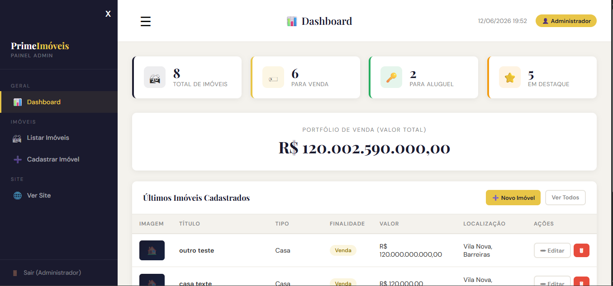
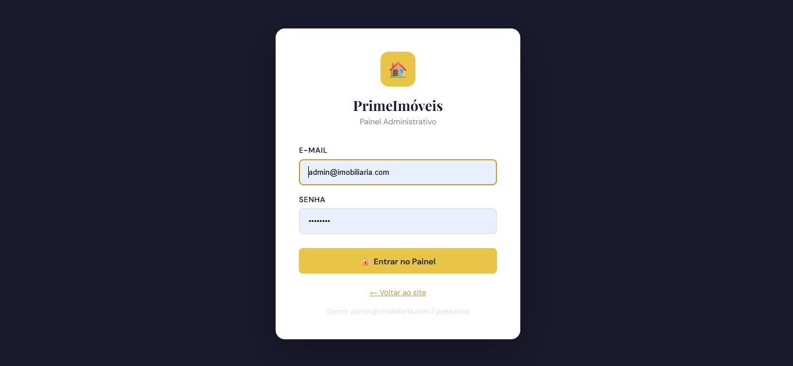

# 🏠 PrimeImóveis

Sistema web completo para gestão de uma agência imobiliária, desenvolvido como projeto prático da disciplina de Back-end Frameworks (UNINASSAU). Permite que visitantes naveguem pelos imóveis disponíveis e que administradores gerenciem o catálogo através de um painel próprio.

🔗 **Acesse o projeto online:** [link aqui](https://primeimoveis.fwh.is/index.php)

---

## 📸 Screenshots

| Página inicial | Detalhes do imóvel |
|---|---|
|  |  |

| Painel administrativo | Login |
|---|---|
|  |  |

---

## ✨ Funcionalidades

- 🔐 Sistema de autenticação para administradores (com `password_hash`/`password_verify`)
- 🏘️ Listagem dinâmica de imóveis cadastrados no banco de dados
- 📄 Página de detalhes individual para cada imóvel
- 📤 Upload de imagens dos imóveis
- 💬 Integração dinâmica com WhatsApp para contato direto sobre cada imóvel
- 🛠️ Painel administrativo responsivo para criar, editar e remover imóveis
- 🛡️ Proteção contra SQL Injection via prepared statements (MySQLi)

---

## 🛠️ Tecnologias utilizadas

- **PHP** (orientado a objetos, MySQLi)
- **MySQL**
- **HTML5 / CSS3** (Grid e Flexbox para responsividade)
- **JavaScript**

---

## 🚀 Como rodar o projeto localmente

```bash
# Clone o repositório
git clone https://github.com/heeenryy/primeimoveis.git

# Importe o banco de dados
# (o arquivo .sql está na pasta /imobiliaria)

# Configure a conexão com o banco em config.php
# host, usuário, senha e nome do banco

# Suba o projeto no seu servidor local (Apache/WSL/XAMPP)
# e acesse via navegador
```

---

## 📚 O que aprendi com esse projeto

Esse foi meu primeiro sistema completo construído sozinho em PHP. Aprofundei conceitos como prepared statements, MySQLi orientado a objetos, manipulação de sessões, upload de arquivos com `move_uploaded_file()`, e organização de CSS com Grid para responsividade.

---

## 👤 Autor

**Henrique**
Estudante de Análise e Desenvolvimento de Sistemas — UNINASSAU
